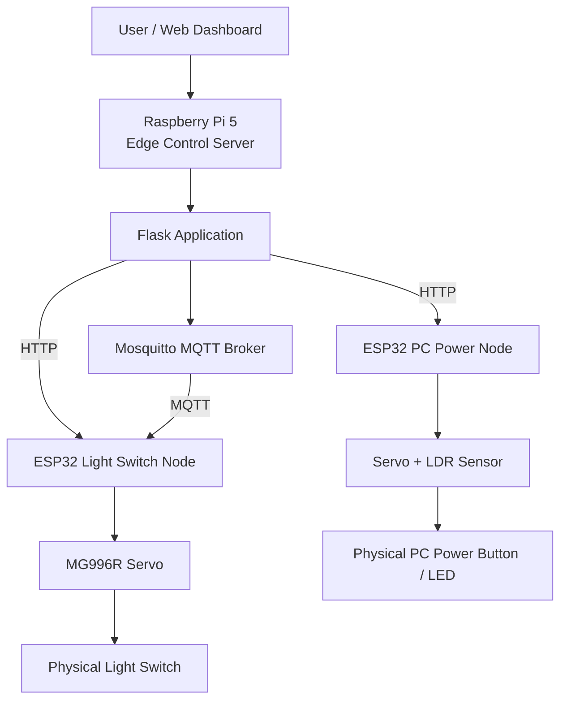

# Edge IoT Vision & Control System

Raspberry Pi 5 and ESP32 based edge IoT control system with physical device actuation, state verification, protocol benchmarking, resource measurement, and bottleneck analysis.

The project began as a practical remote-control system and was later extended into a systems-oriented experiment that separates:

- Communication latency
- ESP32 application processing
- Raspberry Pi resource usage
- ESP32 heap behavior
- Physical actuation latency
- Physical control reliability

The current implemented scope focuses on the **Light Switch Node** and **PC Power Node**.

---

## Key Results

### Protocol Benchmark

All final protocol measurements were performed with:

- ESP32 Wi-Fi Sleep: **OFF**
- 50 warm-up requests per protocol
- 200 requests × 5 runs
- 1000 measured requests per protocol
- 3000 total measured requests
- Sequential request / response
- Interleaved protocol order across runs

All **3000 / 3000 requests succeeded**.

| Protocol | Mean RTT | Median | P95 | P99 | Success |
|---|---:|---:|---:|---:|---:|
| MQTT QoS0 | **15.319 ms** | 13.988 ms | 22.980 ms | 31.076 ms | 1000/1000 |
| HTTP | **20.515 ms** | 19.450 ms | 28.807 ms | 37.038 ms | 1000/1000 |
| MQTT QoS1 | **61.282 ms** | 59.508 ms | 79.849 ms | 94.444 ms | 1000/1000 |

In this implementation and local Wi-Fi environment, MQTT QoS0 produced the lowest application-level RTT.

MQTT QoS1 showed substantially higher RTT than QoS0, reflecting the additional protocol-level reliability path under this implementation.

These measurements are **application-level RTT values**, not pure network propagation latency.


---

## System Architecture



The Raspberry Pi acts as the central edge controller.

The ESP32 boards act as wireless hardware nodes that interface with physical devices.

---

## Implemented Nodes

### Light Switch Node

The Light Switch Node physically presses a wall switch using a servo motor.

Final control parameters:

```text
Servo              : MG996R

REST angle         : 90°
ON angle           : 50°
OFF angle          : 140°

Press hold         : 400 ms
Return wait        : 600 ms
```

Supported functions include:

- HTTP Light ON
- HTTP Light OFF
- Local hardware buttons
- HTTP benchmark endpoint
- MQTT benchmark command / ACK
- ESP32 heap measurement
- RSSI measurement

---

### PC Power Node

The PC Power Node combines two state signals:

```text
Network Ping
+
LDR measurement of the physical PC power LED
```

The PC is considered ON when either:

- Ping succeeds, or
- The power LED is detected as ON

Power-button actuation is permitted only when both indicate an OFF state.

This prevents unnecessary physical power-button presses when the PC is already running.

The LDR uses:

```text
20 samples
5 ms interval per sample
≈ 100 ms programmed sampling delay
```

The PC power servo sequence includes approximately:

```text
Initial REST wait
+ Press hold
+ Return wait
≈ 1950 ms programmed actuator sequence
```

---

## Protocol Benchmark Design

The final protocol benchmark compared:

```text
HTTP
MQTT QoS0
MQTT QoS1
```

The benchmark endpoint intentionally excludes:

- Servo movement
- LDR sampling
- Ping
- Physical device actuation
- Intentional actuator delays

This makes the protocol benchmark primarily a **communication and application-response experiment**.

### Run Structure

```text
Run 1: HTTP      -> MQTT QoS0 -> MQTT QoS1
Run 2: MQTT QoS0 -> MQTT QoS1 -> HTTP
Run 3: MQTT QoS1 -> HTTP      -> MQTT QoS0
Run 4: HTTP      -> MQTT QoS1 -> MQTT QoS0
Run 5: MQTT QoS1 -> MQTT QoS0 -> HTTP
```

Each protocol was measured:

```text
200 requests × 5 runs = 1000 samples
```

Interleaving the protocol order reduces the effect of a fixed protocol execution order on the final comparison.


---

## Latency Distribution

The distribution results remained clearly separated across the three protocol conditions.

MQTT QoS0 produced the lowest typical latency.

HTTP followed at approximately 20 ms mean RTT.

MQTT QoS1 remained near 60 ms for most requests and also showed a larger tail.


Request-by-request behavior can also be seen below.


---

## ESP32 Processing Time

The ESP32 benchmark handler measured its internal processing time separately.

| Protocol | Mean ESP32 Processing |
|---|---:|
| HTTP | **401.999 µs** |
| MQTT QoS0 | **419.632 µs** |
| MQTT QoS1 | **420.765 µs** |

The three values are all approximately **0.4 ms**.

This is much smaller than the measured application RTT:

```text
HTTP       : 20.515 ms
MQTT QoS0  : 15.319 ms
MQTT QoS1  : 61.282 ms
```

Therefore, the protocol-dependent RTT difference was not dominated by the measured ESP32 benchmark-handler computation.


---

## Communication Bottleneck Breakdown

For analysis:

```text
Host / Network / Protocol Remainder
=
Application RTT
-
Measured ESP32 Handler Processing
```

Mean values:

| Protocol | Application RTT | ESP32 Processing | Remainder |
|---|---:|---:|---:|
| HTTP | 20.515 ms | 0.402 ms | 20.113 ms |
| MQTT QoS0 | 15.319 ms | 0.420 ms | 14.900 ms |
| MQTT QoS1 | 61.282 ms | 0.421 ms | 60.862 ms |

The remainder includes multiple components such as:

- Host-side processing
- Wi-Fi communication
- TCP / MQTT protocol handling
- Broker handling
- Response generation
- Response reception

It must **not** be interpreted as pure network latency.


---

## Wi-Fi Power-Saving Diagnostic

During early MQTT testing, many requests unexpectedly showed RTT values near 100 ms.

A controlled comparison of the ESP32 Wi-Fi power-saving configuration was performed.

With Wi-Fi Sleep enabled, a confirmed MQTT QoS0 dry run produced:

```text
Mean RTT ≈ 121.279 ms
```

After disabling Wi-Fi Sleep:

```cpp
WiFi.setSleep(false);
```

a confirmed 30-request run produced:

```text
Mean RTT ≈ 15.886 ms
```

The final 1000-request MQTT QoS0 benchmark reproduced the lower latency:

```text
Mean RTT = 15.319 ms
```

This showed that the ESP32 Wi-Fi power-saving configuration was a major latency factor in this system.

All final protocol comparisons therefore used:

```text
Wi-Fi Sleep = OFF
```

---

## ESP32 Heap Behavior

Each benchmark request also recorded:

- Free Heap
- Minimum Free Heap
- Maximum Allocatable Heap
- RSSI

The complete protocol dataset was reconstructed in chronological measurement order.

Free heap moved between several runtime levels, but no continuous downward trend was observed across the 3000-request experiment.

Therefore, the result is stated conservatively as:

> No cumulative free-heap decrease was observed within the scope of the benchmark.

This does not prove that memory leaks are impossible under every runtime condition.


---

## Raspberry Pi Resource Usage

Raspberry Pi resource usage was measured separately using `psutil`.

Each protocol used:

```text
200 requests × 3 runs
0.2 s request interval
0.2 s resource sampling interval
```

The protocol order was interleaved across runs.

### CPU

| Protocol | Python Worker CPU | Mosquitto CPU |
|---|---:|---:|
| HTTP | 0.429% | 0.008% |
| MQTT QoS0 | 0.397% | 0.037% |
| MQTT QoS1 | 0.403% | 0.043% |


### Memory

| Protocol | Python Worker RSS | Mosquitto RSS |
|---|---:|---:|
| HTTP | 23.165 MiB | 8.406 MiB |
| MQTT QoS0 | 23.371 MiB | 8.406 MiB |
| MQTT QoS1 | 23.389 MiB | 8.406 MiB |


Under the tested sequential 0.2 s workload, all protocol conditions produced low Raspberry Pi resource usage.

The MQTT broker introduced measurable CPU activity compared with its HTTP idle state, but the absolute broker CPU usage remained small.

CPU percentages represent average usage during the complete workload and should not be interpreted as per-request CPU cost.

---

## Physical End-to-End Latency

The protocol benchmark intentionally removed physical actuator delays.

A separate experiment measured the actual Light Switch ON/OFF path.

```text
ON  : 10 measurements
OFF : 10 measurements
Total: 20 measurements
```

Results:

| Metric | Value |
|---|---:|
| ON Mean | 1032.498 ms |
| OFF Mean | 1031.995 ms |
| Overall Mean | **1032.247 ms** |
| Overall Median | 1031.450 ms |
| Minimum | 1028.087 ms |
| Maximum | 1040.075 ms |

The programmed actuator sequence contains:

```text
Press hold  : 400 ms
Return wait : 600 ms

Total programmed delay = 1000 ms
```

Therefore:

```text
Measured mean E2E
= 1032.247 ms

Programmed actuator delay
= 1000 ms
≈ 96.9%

Non-programmed remainder
≈ 32.247 ms
≈ 3.1%
```

This demonstrates that the dominant user-visible latency in the physical Light Switch path is not the communication RTT.

It is the intentionally programmed physical actuator sequence.


ON and OFF showed almost identical latency distributions.


---

## Physical Reliability Improvement

The initial Light Switch prototype used an MG90S servo and achieved:

```text
7 / 20 successful actuations
= 35%
```

The final system used an MG996R servo together with:

- Stronger mechanical mounting
- Control-angle calibration
- 5° / 10° incremental adjustment during tuning

Final reliability testing produced:

```text
ON  : 20 / 20
OFF : 20 / 20

Total
40 / 40
= 100%
```

The improvement should not be attributed to servo torque alone.

The final result came from the combined improvement of:

```text
Actuator capability
+
Mechanical mounting
+
Control-angle calibration
```

A separate short-duration servo stress test also completed:

```text
Duration     : 10 minutes
Cycles       : 172
Temperature  : approximately 26.5°C -> 27.8°C
Observed reset / failure: none
```

---

## Main Findings

The project produced several important observations.

### 1. MQTT QoS0 produced the lowest application RTT

Under the final controlled local Wi-Fi environment:

```text
MQTT QoS0  : 15.319 ms
HTTP       : 20.515 ms
MQTT QoS1  : 61.282 ms
```

The result should be interpreted as specific to this implementation and experimental environment rather than as a universal protocol ranking.

### 2. ESP32 handler computation was not the dominant communication bottleneck

All protocol conditions showed approximately:

```text
0.4 ms
```

of measured ESP32 benchmark-handler processing.

Most of the measured RTT therefore remained outside that interval.

### 3. Wi-Fi power saving strongly affected latency

Disabling ESP32 Wi-Fi Sleep reduced MQTT QoS0 latency from approximately 100 ms scale behavior to approximately 15 ms mean RTT.

### 4. Raspberry Pi resource usage remained low

The Raspberry Pi 5 handled all three protocol workloads with low average CPU usage and similar worker RSS.

### 5. Physical actuation dominated user-visible latency

The actual Light Switch E2E latency was:

```text
1032.247 ms
```

and approximately:

```text
96.9%
```

of that value came from the programmed actuator delay.

### 6. Physical reliability required hardware and mechanical improvements

Reliable control depended not only on communication software but also on:

- Actuator selection
- Mechanical installation
- Control-angle calibration

The final configuration improved from:

```text
35% -> 100%
```

measured actuation success.

---

## Repository Structure

```text
.
├── analysis/
│   ├── analyze_protocol_benchmark.py
│   ├── plot_protocol_benchmark.py
│   ├── plot_bottleneck_heap.py
│   ├── plot_pi_resources.py
│   └── plot_light_e2e.py
│
├── data/
│   ├── README.md
│   ├── raw/
│   │   ├── main/
│   │   ├── diagnostic/
│   │   ├── excluded/
│   │   └── legacy/
│   ├── processed/
│   └── figures/
│
├── esp32/
│   ├── light_switch_node/
│   ├── mqtt_connection_test/
│   └── ...
│
├── raspberry-pi/
│   └── server/
│       ├── benchmarks/
│       ├── resource_worker.py
│       ├── measure_pi_resources.py
│       ├── measure_light_e2e.py
│       └── ...
│
├── docs/
├── images/
├── report/
└── README.md
```

For a detailed description of the measurement datasets:

[Experiment Data Documentation](data/README.md)

---

## Analysis Environment

Main analysis environment:

```text
Python      3.13.5
pandas      3.0.5
NumPy       2.5.2
Matplotlib  3.11.1
psutil      7.2.2
paho-mqtt   2.1.0
```

MQTT environment:

```text
Mosquitto Broker            2.0.21
ESP32 MQTT Library          MQTT by Joel Gaehwiler 2.5.3
```

ESP32 development environment:

```text
Arduino IDE 2.3.10
ESP32 Dev Module
Serial Baud: 115200
```

---

## Reproducing the Analysis

The final protocol raw datasets are stored under:

```text
data/raw/main/
```

Processed data can be regenerated using:

```bash
python analysis/analyze_protocol_benchmark.py
```

Protocol figures:

```bash
python analysis/plot_protocol_benchmark.py
```

Bottleneck and chronological heap figures:

```bash
python analysis/plot_bottleneck_heap.py
```

Raspberry Pi resource figures:

```bash
python analysis/plot_pi_resources.py
```

Light Switch E2E figures:

```bash
python analysis/plot_light_e2e.py
```

The raw CSV files are treated as the source of truth.

---

## Experimental Data Policy

The repository intentionally preserves different classes of data:

```text
main
       Final datasets used for analysis

diagnostic
       Dry runs and hypothesis-testing experiments

excluded
       Measurements intentionally excluded because
       experimental conditions were not valid or verifiable

legacy
       Historical measurements from earlier development stages
```

For example:

- The attempted HTTP Keep-Alive experiment is preserved but excluded because the ESP32 server returned `Connection: close`.
- One Wi-Fi Sleep experiment is preserved but excluded because the firmware condition could not be verified.
- Preliminary Raspberry Pi resource measurements are retained separately from the corrected final measurement.

This prevents rejected data from being silently deleted and makes the analysis process traceable.

---

## Limitations

This project has several limitations.

- The protocol benchmark was performed on one local Wi-Fi environment.
- No artificial packet-loss or congestion environment was introduced.
- All final protocol requests succeeded, so reliability differences between MQTT QoS levels were not experimentally demonstrated through packet loss.
- The ESP32 and Raspberry Pi do not share a synchronized clock, so timestamps from different devices are not directly subtracted.
- `Application RTT - ESP32 Processing` is not treated as pure network latency.
- The End-to-End experiment measures application request completion around the actuator sequence rather than a sensor-detected physical contact timestamp.
- Heap results only support conclusions within the measured workload duration.
- The Raspberry Pi resource benchmark used a sequential 0.2 s request workload and does not represent maximum throughput.

---

## Future Work

Possible extensions include:

- Camera-based 7-segment display recognition
- Vision-assisted physical device state verification
- IR-based appliance control
- MQTT-based production control path
- Longer-duration stability experiments
- Packet-loss and network-congestion experiments
- Higher request-rate throughput testing
- More detailed host / network / protocol timing instrumentation
- Automated physical-state verification
- Edge AI acceleration experiments

---

## Project Direction

The main goal of this project is not simply to remotely move a servo.

It is to build a working edge IoT system and then identify **where latency, resource cost, and reliability problems actually occur across the system stack**.

The final experiments showed that different bottlenecks dominate at different layers:

```text
Communication Layer
→ Protocol and Wi-Fi configuration

Embedded Runtime
→ ESP32 processing and heap behavior

Edge Host
→ Raspberry Pi and broker resource usage

Physical Layer
→ Actuator delay, mounting, and calibration
```

This layered analysis is the main engineering result of the project.
