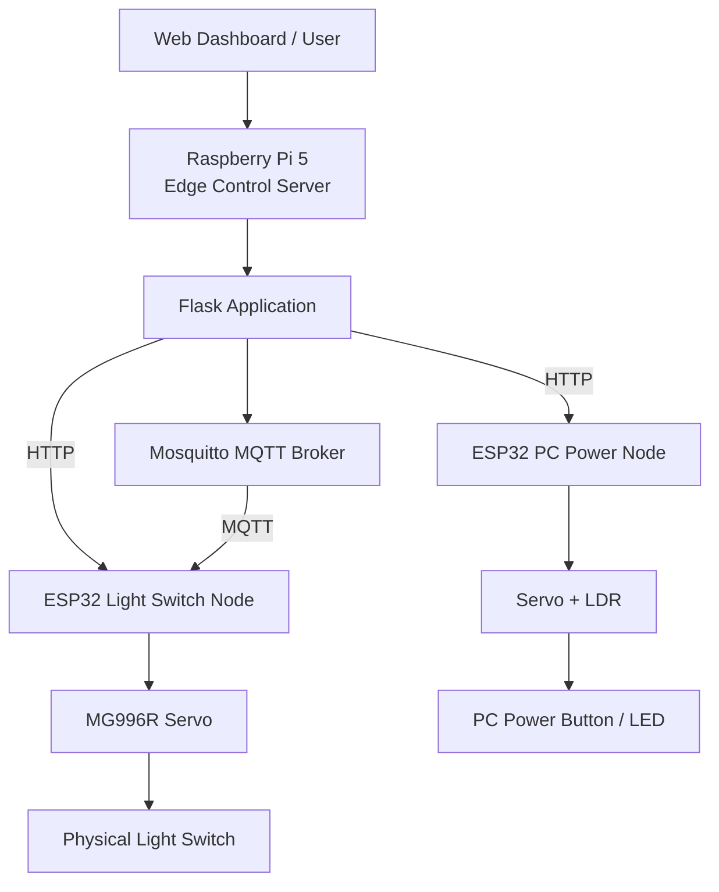

# Edge IoT Vision & Control System

**한국어** | [English](README_EN.md)

Raspberry Pi 5와 ESP32를 이용해 실제 물리 장치를 제어하고, 통신 지연, ESP32 처리시간과 Heap, Raspberry Pi 자원 사용량, 물리 구동 지연과 신뢰성을 직접 측정·분석한 개인 프로젝트입니다.

처음에는 ESP32와 Servo를 이용한 원격 제어 구현에서 시작했으며, 이후 단순히 “작동하는 시스템”을 만드는 것에서 나아가 **어디에서 지연이 발생하고 어떤 요소가 실제 사용자 체감 성능과 안정성을 결정하는지** 분석하는 방향으로 확장했습니다.

> 현재 구현 및 분석 범위는 **Light Switch Node**와 **PC Power Node**를 중심으로 합니다.  
> 프로젝트 이름의 `Vision` 기능은 향후 Camera 기반 상태 인식 기능으로 확장할 계획입니다.

---

## 핵심 결과

### Protocol Benchmark

최종 benchmark는 모든 protocol에서 ESP32 Wi-Fi Sleep을 비활성화한 상태로 수행했습니다.

- HTTP: 1000회
- MQTT QoS 0: 1000회
- MQTT QoS 1: 1000회
- 총 3000회
- 모든 요청 성공: **3000 / 3000**
- Protocol당 200회 × 5 Run
- Run별 protocol 실행 순서를 교차하여 측정 순서 영향을 줄임

| Protocol | Mean RTT | Median | P95 | P99 | 성공 |
|---|---:|---:|---:|---:|---:|
| MQTT QoS 0 | **15.319 ms** | 13.988 ms | 22.980 ms | 31.076 ms | 1000/1000 |
| HTTP | **20.515 ms** | 19.450 ms | 28.807 ms | 37.038 ms | 1000/1000 |
| MQTT QoS 1 | **61.282 ms** | 59.508 ms | 79.849 ms | 94.444 ms | 1000/1000 |

본 프로젝트의 로컬 Wi-Fi 환경과 구현 조건에서는 **MQTT QoS 0가 가장 낮은 Application RTT**를 보였습니다.

이 결과는 “MQTT가 언제나 HTTP보다 빠르다”는 일반적인 결론이 아니라, **본 시스템과 실험 환경에서 관찰된 결과**로 한정합니다.


---

## 시스템 구조



Raspberry Pi 5가 중앙 Edge Controller 역할을 수행하고, ESP32는 실제 물리 장치와 연결되는 무선 Hardware Control Node로 동작합니다.

---

## 구현 기능

### 1. Light Switch Node

Servo Motor를 이용해 벽면 스위치를 실제로 눌러 조명을 ON/OFF합니다.

최종 설정:

```text
Servo       : MG996R

REST angle  : 90°
ON angle    : 50°
OFF angle   : 140°

Press Hold  : 400 ms
Return Wait : 600 ms
```

구현 기능:

- HTTP 기반 Light ON/OFF
- ESP32 Local Button 제어
- HTTP Benchmark Endpoint
- MQTT QoS 0 / QoS 1 Benchmark
- MQTT Application ACK
- ESP32 Free Heap 측정
- Minimum Free Heap 측정
- Maximum Allocatable Heap 측정
- Wi-Fi RSSI 측정

### 2. PC Power Node

PC 상태를 단일 신호로 판단하지 않고 다음 두 정보를 결합합니다.

```text
Network Ping
+
PC 전원 LED의 LDR 측정
```

판단 방식:

```text
Ping 성공 OR LDR에서 LED ON 감지
→ PC ON

Ping 실패 AND LDR에서 LED OFF 감지
→ PC OFF 후보
```

PC가 OFF로 판단된 경우에만 Servo가 실제 Power Button을 누르도록 구성했습니다.

LDR 측정:

```text
20 Samples
5 ms Sample Interval

약 100 ms의 programmed sampling delay
```

PC Power Servo Sequence에는 약 **1950 ms**의 programmed actuator sequence가 포함됩니다.

---

## Protocol Benchmark 설계

통신 protocol 자체의 영향을 보기 위해 Benchmark Endpoint에서는 의도적으로 다음 요소를 제외했습니다.

- Servo 구동
- LDR 측정
- Ping
- 실제 물리 장치 동작
- Servo Hold / Return Delay

즉 이 실험은 실제 Light Switch 동작시간이 아니라 **Communication + Application Response Path**를 측정하기 위한 실험입니다.

### 측정 구성

```text
Warm-up
Protocol당 50회

Main Measurement
Protocol당 200회 × 5 Run
= Protocol당 1000회
```

Run 순서:

```text
Run 1: HTTP       → MQTT QoS 0 → MQTT QoS 1
Run 2: MQTT QoS 0 → MQTT QoS 1 → HTTP
Run 3: MQTT QoS 1 → HTTP       → MQTT QoS 0
Run 4: HTTP       → MQTT QoS 1 → MQTT QoS 0
Run 5: MQTT QoS 1 → MQTT QoS 0 → HTTP
```

특정 protocol이 항상 먼저 또는 마지막에 측정되는 영향을 줄이기 위해 순서를 교차했습니다.


---

## Latency 분포

평균뿐 아니라 Median, P95, P99를 함께 비교했습니다.

MQTT QoS 0는 HTTP보다 낮은 Typical / Tail Latency를 보였고, MQTT QoS 1은 QoS 0보다 높은 Application RTT를 보였습니다.


---

## ESP32 내부 Processing Time

ESP32 Benchmark Handler 내부 처리시간을 별도로 측정했습니다.

| Protocol | Mean ESP32 Processing |
|---|---:|
| HTTP | **401.999 µs** |
| MQTT QoS 0 | **419.632 µs** |
| MQTT QoS 1 | **420.765 µs** |

세 조건 모두 약 **0.4 ms** 수준으로 매우 비슷했습니다.

반면 전체 Application RTT는 다음과 같았습니다.

```text
HTTP       : 20.515 ms
MQTT QoS 0 : 15.319 ms
MQTT QoS 1 : 61.282 ms
```

따라서 protocol 조건에 따라 발생한 수십 ms 수준의 RTT 차이가 **ESP32 Benchmark Handler의 계산시간 때문이라고 보기 어렵다**는 것을 확인했습니다.


---

## Communication Bottleneck 분석

분석을 위해 다음 값을 사용했습니다.

```text
Host / Network / Protocol Remainder
=
Application RTT
-
Measured ESP32 Handler Processing
```

| Protocol | Application RTT | ESP32 Processing | Remainder |
|---|---:|---:|---:|
| HTTP | 20.515 ms | 0.402 ms | 20.113 ms |
| MQTT QoS 0 | 15.319 ms | 0.420 ms | 14.900 ms |
| MQTT QoS 1 | 61.282 ms | 0.421 ms | 60.862 ms |

이 Remainder에는 다음 요소들이 함께 포함될 수 있습니다.

- Raspberry Pi Host Processing
- Wi-Fi Communication
- TCP / MQTT Protocol Handling
- Mosquitto Broker Handling
- Response Generation
- Response Reception

따라서 이 값을 **순수 Network Latency로 해석하지 않습니다.**


---

## Wi-Fi Power Saving과 Latency

초기 MQTT 측정에서는 예상보다 높은 약 100 ms 수준의 RTT가 반복적으로 관찰됐습니다.

ESP32 Wi-Fi Power Saving의 영향을 의심하여 별도의 A/B 실험을 수행했습니다.

Wi-Fi Sleep ON 확인 측정:

```text
MQTT QoS 0 Mean RTT
≈ 121.279 ms
```

이후 다음 설정으로 Wi-Fi Sleep을 비활성화했습니다.

```cpp
WiFi.setSleep(false);
```

확인된 Sleep OFF 측정:

```text
Mean RTT
≈ 15.886 ms
```

최종 1000회 MQTT QoS 0 본실험에서도 다음 값이 재현됐습니다.

```text
Mean RTT
= 15.319 ms
```

따라서 **ESP32 Wi-Fi Power Saving 설정이 본 시스템의 latency에 큰 영향을 주는 요소 중 하나임을 확인**했습니다.

최종 protocol 비교에서는 모든 조건을 다음과 같이 통일했습니다.

```text
Wi-Fi Sleep = OFF
```

---

## ESP32 Heap 분석

각 요청에서 다음 값을 기록했습니다.

- Free Heap
- Minimum Free Heap
- Maximum Allocatable Heap
- RSSI

3000개의 요청을 Timestamp 순으로 다시 정렬하여 Free Heap 변화를 확인했습니다.

실험 중 Free Heap은 여러 Runtime Level 사이에서 변동했지만, 3000회 전체에 걸쳐 지속적으로 감소하는 형태는 관찰되지 않았습니다.

> 본 Benchmark 범위에서는 반복 요청에 따른 누적적인 Free Heap 감소가 관찰되지 않았습니다.

이 결과가 모든 실행 조건에서 Memory Leak이 존재하지 않음을 증명하는 것은 아닙니다.


---

## Raspberry Pi Resource Usage

`psutil`을 이용해 Raspberry Pi 측 자원 사용량을 별도로 측정했습니다.

Protocol당:

```text
200 Requests × 3 Runs
Request Interval: 0.2 s
Resource Sampling Interval: 0.2 s
```

### CPU

| Protocol | Python Worker CPU | Mosquitto CPU |
|---|---:|---:|
| HTTP | 0.429% | 0.008% |
| MQTT QoS 0 | 0.397% | 0.037% |
| MQTT QoS 1 | 0.403% | 0.043% |


### Memory

| Protocol | Python Worker RSS | Mosquitto RSS |
|---|---:|---:|
| HTTP | 23.165 MiB | 8.406 MiB |
| MQTT QoS 0 | 23.371 MiB | 8.406 MiB |
| MQTT QoS 1 | 23.389 MiB | 8.406 MiB |


현재의 순차 요청 workload에서는 세 protocol 모두 Raspberry Pi 5에 큰 자원 부담을 주지 않았습니다.

MQTT 사용 시 Mosquitto의 CPU Activity가 HTTP Idle 상태보다 증가했지만 절대값은 매우 작았습니다.

위 CPU 값은 요청 하나의 CPU Cost가 아니라 **0.2초 요청 간격을 포함한 전체 Workload에서 측정한 평균 사용량**입니다.

---

## 실제 Light Control End-to-End Latency

Protocol Benchmark에서는 Servo Delay를 제외했으므로 실제 물리 제어의 사용자 체감 latency를 별도로 측정했습니다.

```text
ON   : 10회
OFF  : 10회
Total: 20회
```

| Metric | Value |
|---|---:|
| ON Mean | 1032.498 ms |
| OFF Mean | 1031.995 ms |
| Overall Mean | **1032.247 ms** |
| Overall Median | 1031.450 ms |
| Min | 1028.087 ms |
| Max | 1040.075 ms |

Light Control에는 다음 programmed delay가 포함됩니다.

```text
Press Hold  : 400 ms
Return Wait : 600 ms

Total Programmed Delay
= 1000 ms
```

평균 E2E 기준:

```text
Measured E2E
= 1032.247 ms

Programmed Actuator Delay
= 1000 ms
≈ 96.9%

Non-programmed Remainder
≈ 32.247 ms
≈ 3.1%
```

즉 본 시스템의 실제 Light Control에서는 수십 ms 수준의 통신 latency보다 **Servo 구동을 위해 의도적으로 설정한 약 1초의 Actuator Sequence가 사용자 체감 latency를 지배**했습니다.


---

## 물리 구동 신뢰성 개선

초기 Light Switch Prototype은 MG90S Servo를 사용했고 다음 성공률을 보였습니다.

```text
7 / 20 성공
= 35%
```

이후 다음 요소를 함께 개선했습니다.

- MG996R Servo로 변경
- Servo 및 구조물 고정 강화
- 5° / 10° 단위 Control Angle Calibration

최종 시험:

```text
ON  : 20 / 20
OFF : 20 / 20

Total
40 / 40
= 100%
```

따라서 신뢰성 향상을 단순히 Servo Torque 증가 하나의 영향으로 해석하지 않고 다음 요소의 복합적인 개선 결과로 해석했습니다.

```text
Actuator Capability
+
Mechanical Mounting
+
Control Angle Calibration
```

### Servo Short-Term Stress Test

```text
Duration       : 10 min
Cycles         : 172
Surface Temp   : 약 26.5°C → 27.8°C
Reset / Failure: 관찰되지 않음
```

---

## 주요 결론

1. **본 실험 환경에서는 MQTT QoS 0가 가장 낮은 Application RTT를 보였습니다.**
2. **ESP32 내부 Handler Processing은 protocol 간 RTT 차이의 주요 원인이 아니었습니다.**
3. **Wi-Fi Power Saving 설정이 latency에 큰 영향을 주었습니다.**
4. **현재 workload에서 Raspberry Pi 5의 자원 사용량은 낮은 수준이었습니다.**
5. **실제 Light Control의 사용자 체감 latency는 Communication보다 Physical Actuation이 지배했습니다.**
6. **물리 제어 신뢰성은 Software뿐 아니라 Actuator, Mounting, Calibration에도 크게 영향을 받았습니다.**

---

## Repository 구조

```text
.
├── analysis/
│   ├── analyze_protocol_benchmark.py
│   ├── plot_protocol_benchmark.py
│   ├── plot_bottleneck_heap.py
│   ├── plot_pi_resources.py
│   └── plot_light_e2e.py
│
├── data/
│   ├── README.md
│   ├── README_EN.md
│   ├── raw/
│   │   ├── main/
│   │   ├── diagnostic/
│   │   ├── excluded/
│   │   └── legacy/
│   ├── processed/
│   └── figures/
│
├── esp32/
├── raspberry-pi/
├── docs/
├── images/
├── report/
├── README.md
└── README_EN.md
```

실험 데이터의 구체적인 구분과 제외 기준은 다음 문서에 기록했습니다.

[실험 데이터 문서](data/README.md) | [English](data/README_EN.md)

---

## 분석 환경

```text
Python      3.13.5
pandas      3.0.5
NumPy       2.5.2
Matplotlib  3.11.1
psutil      7.2.2
paho-mqtt   2.1.0
```

MQTT:

```text
Mosquitto Broker   2.0.21
ESP32 MQTT Library MQTT by Joel Gaehwiler 2.5.3
```

ESP32 개발 환경:

```text
Arduino IDE 2.3.10
Board: ESP32 Dev Module
Serial Baud: 115200
```

---

## 분석 재현

```bash
python analysis/analyze_protocol_benchmark.py
python analysis/plot_protocol_benchmark.py
python analysis/plot_bottleneck_heap.py
python analysis/plot_pi_resources.py
python analysis/plot_light_e2e.py
```

Raw CSV를 분석의 Source of Truth로 사용합니다.

---

## Data 관리 기준

```text
main
→ 최종 분석에 사용한 데이터

diagnostic
→ Dry Run 및 원인 분석용 데이터

excluded
→ 실험 조건이 유효하지 않거나 확인되지 않아
   최종 분석에서 제외한 데이터

legacy
→ 프로젝트 초기 단계의 Historical Data
```

잘못된 데이터를 단순 삭제하기보다 **왜 최종 분석에서 제외했는지 기록을 남기는 것**을 원칙으로 했습니다.

---

## 한계

- 하나의 Local Wi-Fi 환경에서 측정했습니다.
- 인위적인 Packet Loss나 Network Congestion 환경은 구성하지 않았습니다.
- 최종 Protocol Benchmark가 모두 성공했기 때문에 QoS에 따른 실제 Packet Loss Reliability 차이는 검증하지 못했습니다.
- Raspberry Pi와 ESP32는 동일 Clock을 공유하지 않으므로 장치 간 Absolute Timestamp를 직접 빼지 않았습니다.
- `RTT - ESP Processing`을 순수 Network Latency로 해석하지 않습니다.
- Light E2E는 외부 Sensor로 실제 물리 접촉 순간을 측정한 값이 아니라 Application Request Completion 기준입니다.
- Heap 결과는 측정한 Workload 범위 내에서만 해석합니다.
- Raspberry Pi Resource 실험은 0.2초 간격의 Sequential Workload이며 Maximum Throughput 실험이 아닙니다.

---

## 향후 확장

- Pi Camera 기반 7-Segment Display 인식
- Camera 기반 Physical Device State Verification
- IR 기반 Appliance Control
- MQTT 기반 실제 Device Control Path 확장
- 장시간 Stability Test
- Packet Loss / Network Congestion 조건 실험
- Higher Request Rate / Throughput 실험
- 더 세분화된 Host / Network / Protocol Timing
- Physical State Verification 자동화
- Edge AI / Hardware Acceleration 실험

---

## 프로젝트를 통해 확인한 점

이 프로젝트의 목표는 단순히 Servo를 원격으로 움직이는 것에 그치지 않습니다.

실제로 동작하는 Edge IoT System을 구현한 뒤, **시스템의 어느 계층에서 latency와 reliability 문제가 발생하는지 직접 측정하고 구분하는 것**을 목표로 했습니다.

```text
Communication Layer
→ Protocol / Wi-Fi Configuration

Embedded Runtime
→ ESP32 Processing / Heap

Edge Host
→ Raspberry Pi / Mosquitto Resource

Physical Layer
→ Actuator Delay / Mounting / Calibration
```

단순 기능 구현에서 끝나지 않고, 구현한 시스템의 실제 동작을 측정하고 원인을 추적하는 과정까지 수행한 것이 이 프로젝트의 핵심입니다.
