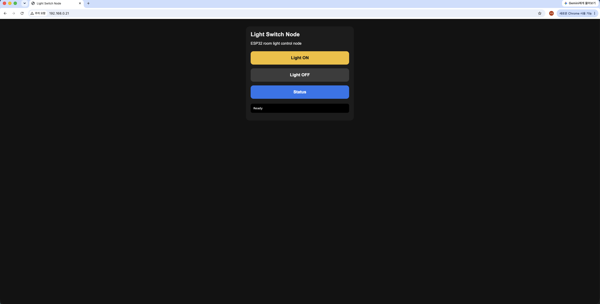

# Edge IoT Vision & Control System

## Overview

This project implements a Raspberry Pi 5 and ESP32 based edge IoT control system.

The Raspberry Pi 5 acts as a central edge control server, while ESP32 boards operate as wireless hardware control nodes for physical switch control, sensor-based state verification, local button input, and future IR-based device control.

The goal of this project is not only to build a working IoT device, but also to analyze communication latency, control reliability, ESP32 memory usage, servo motor behavior, and hardware power stability in an embedded edge system.

The current prototype includes a Raspberry Pi Flask dashboard, an ESP32 Light Switch Node, and an ESP32 PC Power Node. The system demonstrates browser-based remote control, physical servo actuation, LDR-based state sensing, ping-based PC status checking, and safety logic for conditional control.

## Project Goals

- Build a Raspberry Pi 5 based central control server
- Implement ESP32 based wireless hardware control nodes
- Control physical switches using servo motors
- Support remote control through Raspberry Pi
- Support local hardware input using tact switches
- Measure Raspberry Pi to ESP32 communication latency
- Monitor ESP32 free heap during repeated operation
- Test external 5V power for servo motor control
- Measure servo motor surface temperature during repeated actuation
- Use an LDR sensor for basic state verification
- Implement PC power state verification using LDR and ping
- Prevent unsafe repeated PC power button presses using software lock logic
- Extend the system with IR communication
- Reserve camera-based state recognition as a future extension

## System Architecture

### Current Implemented Architecture

```text
Phone / MacBook / Web Browser
        |
        v
Raspberry Pi 5
Flask Dashboard Server
        |
   Wi-Fi / HTTP
        |
        |----------------------|
        v                      v
ESP32 Light Switch Node   ESP32 PC Power Node
        |                      |
        |-- Servo Motor        |-- Servo Motor
        |   -> Wall Switch     |   -> PC Power Button
                               |
                               |-- LDR Sensor
                               |   -> PC Power LED Check

Raspberry Pi also checks the PC network state using ping.
```

The current system includes two ESP32 hardware control nodes.

The Raspberry Pi Flask dashboard integrates both nodes into a single browser-based control interface.

### Target Architecture

```text
Phone / Web Browser
        |
        v
Raspberry Pi 5 Edge Control Server
        |
   Wi-Fi / HTTP or MQTT
        |
        |----------------------|----------------------|
        v                      v                      v
ESP32 Light Switch Node   ESP32 PC Power Node   ESP32 IR Node
        |                      |                      |
        |-- Servo Motor        |-- Servo Motor        |-- IR Receiver
        |   -> Wall Switch     |   -> PC Button       |-- IR LED
                               |
                               |-- LDR Sensor
                               |   -> PC LED Check
                               |
                               |-- Tact Switch
```

### Future Camera Extension

```text
Raspberry Pi 5
        |
        |-- Camera Module
        |
        v
Device Display / Status LED / 7-Segment Recognition
```

The camera extension will be used to verify the actual state of a device after a command is sent, especially for one-way IR control scenarios.

The camera feature is not part of the current main implementation and is treated as future work.

## Hardware

| Component | Role |
|---|---|
| Raspberry Pi 5 8GB | Central edge server |
| ESP32-DEVKITC-32E | Wireless hardware control node |
| SG90 Servo Motor | Lightweight physical switch control |
| MG90S Servo Motor | Physical switch and PC button control test |
| Higher Torque Servo Motor | Planned replacement for wall light switch control |
| LDR Sensor Module | Analog light sensing and state checking |
| IR Receiver Module 38kHz | IR signal receiving |
| IR LED 940nm | IR signal transmission |
| 2N2222A NPN Transistor | IR LED driving circuit |
| 5V 5A External Power Adapter | External servo power supply |
| DC Jack Terminal | External power input connection |
| WAGO Connectors | Power distribution |
| Red / Black Power Wires | 5V and GND wiring |
| Wire Stripper | Power wire preparation |
| Tact Switch | Local button input |
| Breadboard and Jumper Wires | Circuit prototyping |
| Digital Multimeter | Voltage and continuity measurement |
| Infrared Thermometer | Servo motor surface temperature measurement |
| Raspberry Pi Camera Module | Future camera-based state recognition |

## Repository Structure

```text
docs/
├── experiment_log.md
├── hardware_list.md
└── project_plan.md

raspberry-pi/
├── scripts/
└── server/
    ├── app.py
    ├── measure_esp32_latency.py
    ├── requirements.txt
    └── archive/

esp32/
├── board_info_test/
├── wifi_test/
├── http_server_test/
├── servo_measurement_test/
├── ldr_raw_value_test/
├── ldr_threshold_test/
├── servo_ldr_measurement_test/
├── button_test/
├── light_switch_node/
├── pc_power_node/
├── ir_node/
└── servo_node/

data/
├── raw/
│   ├── esp32_latency_rpi_to_esp32_100.csv
│   └── servo_ldr_measurement_10min_raw_log.txt
│
└── processed/
    ├── esp32_latency_rpi_to_esp32_summary.csv
    ├── servo_ldr_measurement_10min_clean.csv
    ├── servo_ldr_measurement_summary.csv
    └── mg90s_temperature_summary.csv

images/
├── architecture/
├── hardware/
├── results/
├── issues/
└── wiring/

report/
└── figures/
```

## Current Status

- [x] Prepare project repository structure
- [x] Prepare hardware components
- [x] Assemble Raspberry Pi 5 case and active cooler
- [x] Install Raspberry Pi OS 64-bit
- [x] Enable Wi-Fi and SSH access
- [x] Verify headless SSH access from MacBook
- [x] Update Raspberry Pi system packages
- [x] Check Raspberry Pi temperature and throttling status
- [x] Clone GitHub repository on Raspberry Pi
- [x] Run a Flask-based test server on Raspberry Pi
- [x] Access Raspberry Pi server from MacBook browser
- [x] Set up ESP32 development environment
- [x] Verify ESP32 board information
- [x] Connect ESP32 to Wi-Fi
- [x] Run ESP32 HTTP server test
- [x] Connect Raspberry Pi server to ESP32 node
- [x] Measure Raspberry Pi to ESP32 communication latency
- [x] Control MG90S servo motor with ESP32
- [x] Test external 5V servo power with common GND
- [x] Test LDR sensor raw analog values
- [x] Measure MG90S servo motor temperature during repeated operation
- [x] Integrate Wi-Fi, HTTP, servo, and LDR code into ESP32 nodes
- [x] Implement ESP32 Light Switch Node
- [x] Implement ESP32 PC Power Node
- [x] Implement remote servo actuation through Raspberry Pi
- [x] Test PC power LED detection using LDR sensor
- [x] Integrate Light Switch Node and PC Power Node into Raspberry Pi dashboard
- [x] Add PC power button safety lock based on ping and LDR state verification
- [x] Identify MG90S torque limitation for wall light switch OFF direction
- [ ] Replace Light Switch Node servo with a higher-torque servo motor
- [ ] Test local button input
- [ ] Test external power stability using a digital multimeter
- [ ] Test IR communication
- [ ] Write final report
- [ ] Test camera-based state recognition as future work

## Implemented Features

### Raspberry Pi Flask Server

A Flask server was implemented to verify that the Raspberry Pi can operate as a central server on the local network.

Initially implemented endpoints:

```text
GET /
GET /api/ping
GET /api/light/toggle
GET /api/esp32/ping
```

The Raspberry Pi server was successfully accessed from a MacBook browser through the Raspberry Pi local IP address and port `5000`.

This confirmed the initial communication path:

```text
MacBook Browser -> Local Wi-Fi Network -> Raspberry Pi Flask Server
```

### ESP32 HTTP Server

ESP32 was configured as a Wi-Fi connected HTTP server.

The ESP32 responded to `/api/ping` requests and returned status information such as device role, uptime, free heap, and RSSI.

### Raspberry Pi to ESP32 Communication

The Raspberry Pi successfully sent HTTP requests to the ESP32 over the local Wi-Fi network.

This confirmed the control path:

```text
Raspberry Pi Flask Server -> Local Wi-Fi Network -> ESP32 HTTP Server
```

### Raspberry Pi Integrated Dashboard

The Raspberry Pi Flask server was extended into an integrated dashboard that controls multiple ESP32 nodes.

Implemented dashboard functions:

```text
Light Switch Node
- Check node status
- Turn light ON
- Turn light OFF
- Reset servo position

PC Power Node
- Check PC power state
- Display ping result
- Display LDR average value
- Display LDR threshold
- Enable PC power button only when the PC is detected as OFF_CANDIDATE
```

The dashboard confirms the current multi-node control path:

```text
Web Browser
        |
        v
Raspberry Pi Flask Dashboard
        |
        |-- ESP32 Light Switch Node
        |
        |-- ESP32 PC Power Node
```

### ESP32 Light Switch Node

The Light Switch Node uses an ESP32 and an MG90S servo motor to physically control a wall-mounted light switch.

Implemented endpoints:

```text
GET /
GET /api/ping
GET /api/status
GET /api/light/on
GET /api/light/off
GET /api/servo/rest
```

The Light Switch Node successfully responded to both its own web UI and the Raspberry Pi dashboard.

The ON direction worked relatively well, but the OFF direction was unstable because the wall switch required more mechanical force than the MG90S servo could reliably provide.

### ESP32 PC Power Node

The PC Power Node uses an ESP32, an LDR sensor, and a servo motor to detect PC power state and physically press the PC power button.

Implemented endpoints:

```text
GET /
GET /api/ping
GET /api/status
GET /api/ldr
GET /api/pc/status
GET /api/pc/power/press
GET /api/servo/init
GET /api/servo/rest
```

The LDR sensor detects the PC power LED state, while the Raspberry Pi also checks the PC network state using ping.

The PC power button is locked when the PC is already detected as ON, preventing accidental power button presses.

## Measurement Results

### Raspberry Pi to ESP32 Latency Test

Raspberry Pi sent 100 repeated HTTP requests to the ESP32 `/api/ping` endpoint.

| Metric | Value |
|---|---:|
| Total requests | 100 |
| Successful requests | 100 |
| Failed requests | 0 |
| Success rate | 100% |
| Minimum latency | 82.42 ms |
| Maximum latency | 126.07 ms |
| Average latency | 114.017 ms |
| Median latency | 114.56 ms |

Raw and processed data:

```text
data/raw/esp32_latency_rpi_to_esp32_100.csv
data/processed/esp32_latency_rpi_to_esp32_summary.csv
```

### MG90S Servo Motor Stability Test

A 10-minute repeated actuation test was performed using an ESP32 and an MG90S servo motor powered by an external 5V supply.

The servo motor was controlled through GPIO18, while an LDR sensor was connected to GPIO34 for analog light sensing.

| Metric | Value |
|---|---:|
| Test duration | 10 minutes |
| Total servo actuation trials | 172 |
| Servo control pin | GPIO18 |
| LDR analog input pin | GPIO34 |
| Initial free heap | 330252 bytes |
| Final free heap | 329648 bytes |
| Heap difference during each trial | 0 bytes |
| Temperature before test | 26.5°C |
| Temperature after 5 minutes | 27.6°C |
| Temperature after 10 minutes | 27.8°C |
| Temperature increase after 10 minutes | +1.3°C |

No ESP32 reset, servo failure, or overheating was observed during the test.

Raw and processed data:

```text
data/raw/servo_ldr_measurement_10min_raw_log.txt
data/processed/servo_ldr_measurement_10min_clean.csv
data/processed/servo_ldr_measurement_summary.csv
data/processed/mg90s_temperature_summary.csv
```

### PC Power LED Detection Test

The PC Power Node uses an LDR sensor to detect the PC power LED state.

Observed LDR values:

| PC State | LDR Value |
|---|---:|
| PC ON | approximately 57 to 2905 |
| PC OFF | approximately 4095 |

The initial threshold was set to 3000.

However, because the PC ON state sometimes produced values close to 2905, the threshold was updated to 3500 for better stability.

Decision rule:

```text
LDR average < 3500  -> PC LED ON
LDR average >= 3500 -> PC LED OFF
```

The Raspberry Pi also checks the PC using ping.

Final PC state decision rule:

```text
ping success OR LDR LED ON -> PC ON
ping failed AND LDR LED OFF -> OFF_CANDIDATE
```

When the PC is detected as ON, the dashboard disables the PC power button.

### Light Switch Control Test

The Light Switch Node was tested on a real wall-mounted light switch using an MG90S servo motor.

| Metric | Value |
|---|---:|
| Servo motor | MG90S |
| Control target | Wall light switch |
| Initial repeated success | 7 trials |
| Failure started | 8th trial |
| Final success rate | 35.0% |

The ON direction worked relatively well.

However, the OFF direction was unstable because the physical switch required more torque than the MG90S servo could reliably provide.

This result shows that the failure was not caused by software or HTTP communication errors, but by the mechanical limitation of the actuator and mounting structure.

## Experiment Images

Representative hardware setup and result images are stored in:

```text
images/hardware/
images/results/
images/issues/
images/wiring/
```

### Prototype Hardware Setup

```text
images/hardware/servo_ldr_measurement_setup.jpg
images/hardware/pc_power_node_servo_ldr_mount.jpg
images/hardware/light_switch_node_servo_mount.jpg
images/wiring/raspberry_pi_and_servo_power_wiring.jpg
```

### Measurement Result Images

```text
images/results/mg90s_temperature_before.jpg
images/results/mg90s_temperature_5min.jpg
images/results/mg90s_temperature_10min.jpg
images/results/servo_ldr_measurement_serial_monitor.png
images/results/rpi_to_esp32_latency_100_requests.png
```

### Web UI and Dashboard Screenshots

```text
images/results/light_switch_node_web_ui.png
images/results/pc_power_node_web_ui_off_state.png
images/results/integrated_dashboard_light_node_online.png
images/results/integrated_dashboard_pc_off_candidate.png
```

Example prototype setup:


Example dashboard screenshots:




## Planned Experiments

1. Replace the Light Switch Node servo motor with a higher-torque servo
2. Compare MG90S and higher-torque servo performance on the wall switch
3. Test local tact switch input for hardware-level manual control
4. Measure external 5V power stability using a digital multimeter
5. Implement IR receiver test
6. Implement IR transmitter test
7. Add IR control card to the Raspberry Pi dashboard
8. Compare HTTP-based control with MQTT-based control as an extension
9. Reserve camera-based visual state recognition as future work

## Development Log

Detailed daily progress is recorded in:

```text
docs/experiment_log.md
```

The final report will be organized under:

```text
report/
```

## Next Steps

The current core prototype is functional.

The next hardware task is to replace the MG90S servo motor used in the Light Switch Node with a higher-torque servo motor. The current MG90S servo was able to control the ON direction of the wall switch, but it did not provide enough torque for stable OFF-direction control.

After replacing the servo motor, the Light Switch Node will be tested again and compared with the previous MG90S result.

The next functional extension is IR communication.

Planned IR extension:

```text
Raspberry Pi Flask Dashboard
        |
        v
ESP32 IR Node
        |
        |-- IR Receiver -> Learn remote control signal
        |-- IR LED      -> Transmit learned signal
```

The Pi Camera extension is not included in the current main implementation.

It will be treated as future work for visual state recognition, such as detecting device display values, 7-segment indicators, or status LEDs.