# Edge IoT Vision & Control System

[한국어](README.md) | **English**

This is a personal project using Raspberry Pi 5 and ESP32 to control physical devices and directly measure and analyze communication latency, ESP32 processing time and heap behavior, Raspberry Pi resource usage, physical actuation latency, and control reliability.

The project started as a remote-control system using ESP32 and servo motors. It was later extended beyond simply making the system work, with a focus on analyzing where latency occurs and which factors affect user-visible performance and reliability.

> The current implementation and analysis focus on the **Light Switch Node** and **PC Power Node**.

---

## Key Results

### Protocol Benchmark

All final protocol measurements were performed with ESP32 Wi-Fi Sleep disabled.

- HTTP: 1000 requests
- MQTT QoS 0: 1000 requests
- MQTT QoS 1: 1000 requests
- 3000 total requests
- All requests succeeded: **3000 / 3000**
- 200 requests × 5 runs per protocol
- Protocol order was rotated across runs to reduce fixed-order effects

| Protocol | Mean RTT | Median | P95 | P99 | Success |
|---|---:|---:|---:|---:|---:|
| MQTT QoS 0 | **15.319 ms** | 13.988 ms | 22.980 ms | 31.076 ms | 1000/1000 |
| HTTP | **20.515 ms** | 19.450 ms | 28.807 ms | 37.038 ms | 1000/1000 |
| MQTT QoS 1 | **61.282 ms** | 59.508 ms | 79.849 ms | 94.444 ms | 1000/1000 |

In this implementation and local Wi-Fi environment, MQTT QoS 0 produced the lowest application-level RTT.

MQTT QoS 1 showed substantially higher application-level RTT than MQTT QoS 0.

This result is specific to the tested system and experimental environment and should not be interpreted as a universal protocol ranking.

These measurements are **application-level RTT values**, not pure network propagation latency.

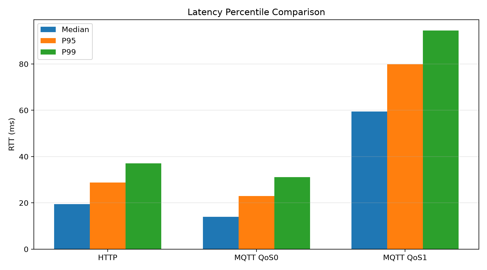

---

## System Architecture

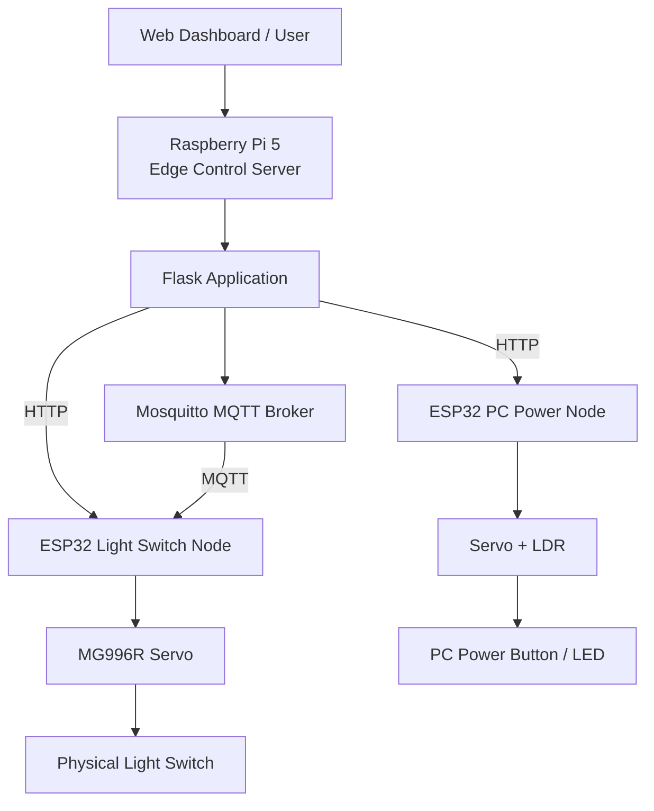

The Raspberry Pi 5 acts as the central edge controller, while the ESP32 boards operate as wireless hardware-control nodes connected to physical devices.

---

## Implemented Nodes

### 1. Light Switch Node

The Light Switch Node physically presses a wall switch using an MG996R servo.

Final configuration:

```text
Servo       : MG996R

REST angle  : 90°
ON angle    : 50°
OFF angle   : 140°

Press Hold  : 400 ms
Return Wait : 600 ms
```

Supported functions include:

- HTTP Light ON/OFF
- Local ESP32 button control
- HTTP benchmark endpoint
- MQTT QoS 0 / QoS 1 benchmark
- MQTT application ACK
- ESP32 Free Heap measurement
- Minimum Free Heap measurement
- Maximum Allocatable Heap measurement
- Wi-Fi RSSI measurement

### 2. PC Power Node

The PC Power Node combines two state signals:

```text
Network Ping
+
LDR measurement of the PC power LED
```

Decision logic:

```text
Ping success OR LDR detects LED ON
→ PC ON

Ping failure AND LDR detects LED OFF
→ PC OFF candidate
```

The servo presses the physical power button only when the PC is classified as an OFF candidate.

LDR sampling:

```text
20 samples
5 ms sample interval

≈ 100 ms programmed sampling delay
```

The PC power servo sequence contains approximately **1950 ms** of programmed actuator timing.

---

## Protocol Benchmark Design

The benchmark endpoint intentionally excludes:

- Servo movement
- LDR sampling
- Ping
- Physical device actuation
- Servo hold / return delays

The purpose is to measure the **communication and application-response path** separately from physical actuation.

### Measurement Configuration

```text
Warm-up
50 requests per protocol

Main Measurement
200 requests × 5 runs
= 1000 samples per protocol
```

Run order:

```text
Run 1: HTTP       → MQTT QoS 0 → MQTT QoS 1
Run 2: MQTT QoS 0 → MQTT QoS 1 → HTTP
Run 3: MQTT QoS 1 → HTTP       → MQTT QoS 0
Run 4: HTTP       → MQTT QoS 1 → MQTT QoS 0
Run 5: MQTT QoS 1 → MQTT QoS 0 → HTTP
```

The protocol order was rotated to reduce fixed-order effects.

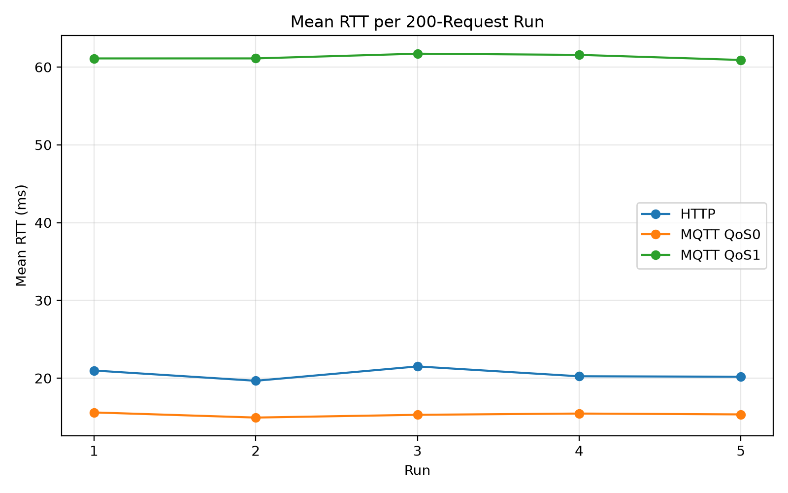

---

## Latency Distribution

The analysis compares not only mean latency, but also median, P95, and P99 values.

MQTT QoS 0 showed lower typical and tail latency than HTTP, while MQTT QoS 1 showed higher application-level RTT than MQTT QoS 0.

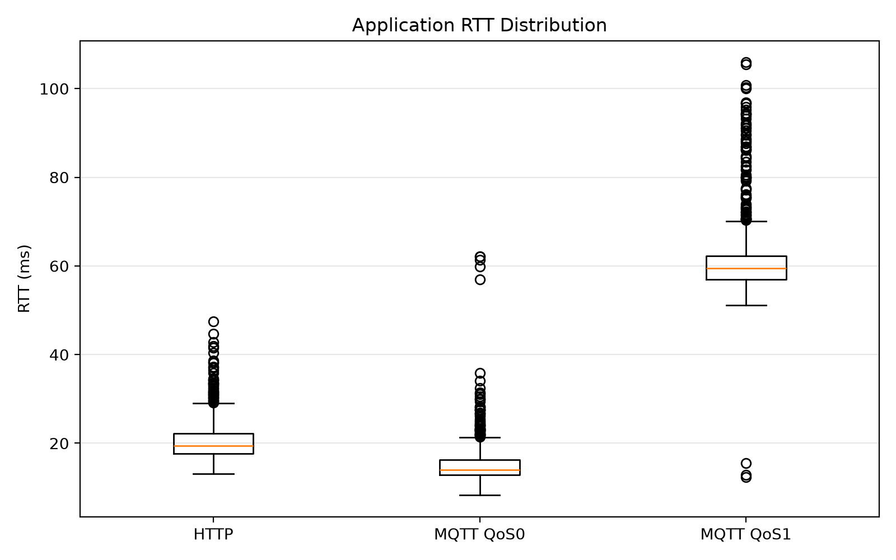

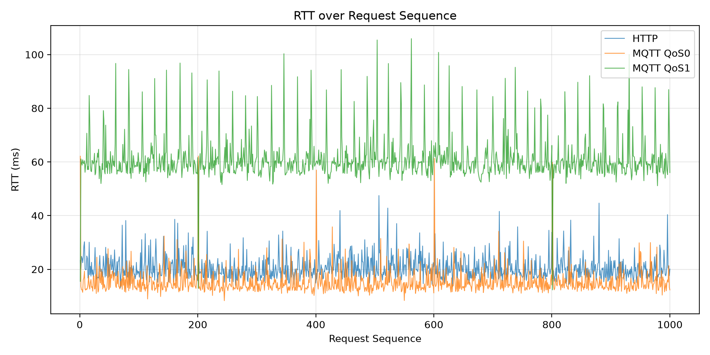

---

## ESP32 Processing Time

Processing time inside the ESP32 benchmark handler was measured separately.

| Protocol | Mean ESP32 Processing |
|---|---:|
| HTTP | **401.999 µs** |
| MQTT QoS 0 | **419.632 µs** |
| MQTT QoS 1 | **420.765 µs** |

All three conditions were close to **0.4 ms**.

The measured application RTT values were:

```text
HTTP       : 20.515 ms
MQTT QoS 0 : 15.319 ms
MQTT QoS 1 : 61.282 ms
```

Therefore, the protocol-dependent RTT differences were not dominated by the measured ESP32 benchmark-handler computation.

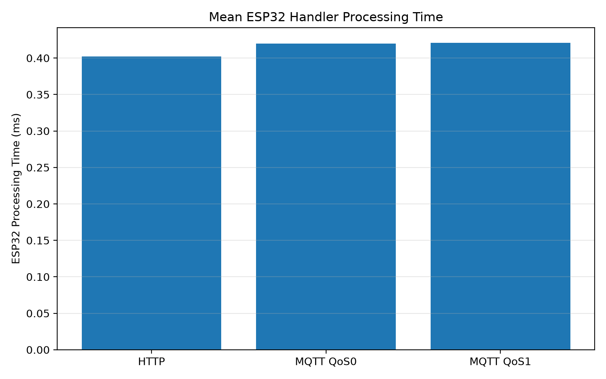

---

## Communication Bottleneck Analysis

The following derived value was used:

```text
Host / Network / Protocol Remainder
=
Application RTT
-
Measured ESP32 Handler Processing
```

| Protocol | Application RTT | ESP32 Processing | Remainder |
|---|---:|---:|---:|
| HTTP | 20.515 ms | 0.402 ms | 20.113 ms |
| MQTT QoS 0 | 15.319 ms | 0.420 ms | 14.900 ms |
| MQTT QoS 1 | 61.282 ms | 0.421 ms | 60.862 ms |

The remainder may include:

- Raspberry Pi host processing
- Wi-Fi communication
- TCP / MQTT protocol handling
- Mosquitto broker handling
- Response generation
- Response reception

It is **not interpreted as pure network latency**.

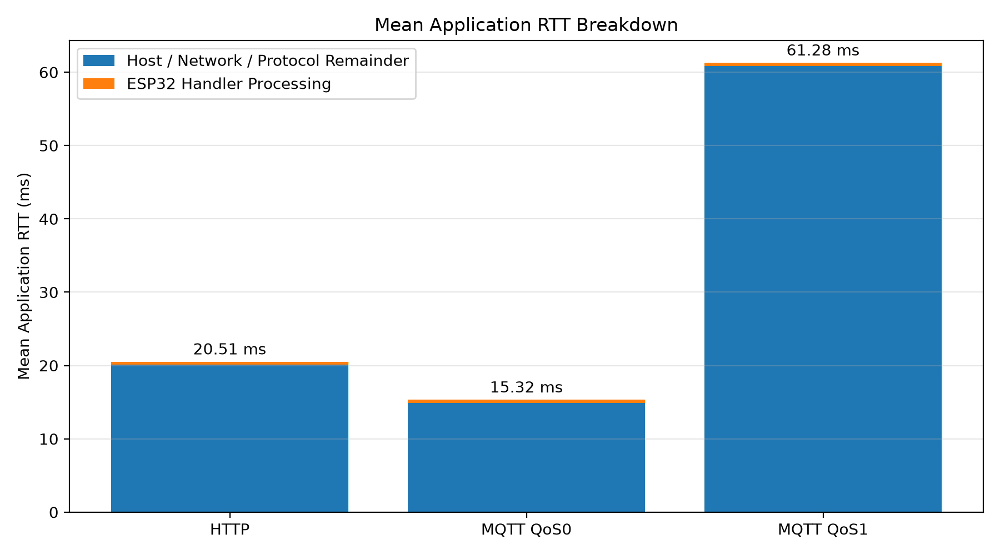

---

## Wi-Fi Power Saving and Latency

Early MQTT measurements repeatedly showed unexpectedly high RTT values near the 100 ms scale.

A separate A/B diagnostic was performed to test the effect of ESP32 Wi-Fi power saving.

Confirmed Wi-Fi Sleep ON measurement:

```text
MQTT QoS 0 Mean RTT
≈ 121.279 ms
```

After disabling Wi-Fi Sleep:

```cpp
WiFi.setSleep(false);
```

a confirmed Sleep OFF run produced:

```text
Mean RTT
≈ 15.886 ms
```

The final 1000-request MQTT QoS 0 benchmark reproduced a similar result:

```text
Mean RTT
= 15.319 ms
```

This indicates that ESP32 Wi-Fi power-saving behavior was an important latency factor in this system.

All final protocol comparisons used:

```text
Wi-Fi Sleep = OFF
```

---

## ESP32 Heap Analysis

Each request recorded:

- Free Heap
- Minimum Free Heap
- Maximum Allocatable Heap
- RSSI

The 3000 samples were reconstructed in chronological timestamp order.

Free Heap moved between several runtime levels, but no continuous downward trend was observed across the full benchmark.

> No cumulative free-heap decrease was observed within the scope of the benchmark.

This does not prove that memory leaks are impossible under all runtime conditions.

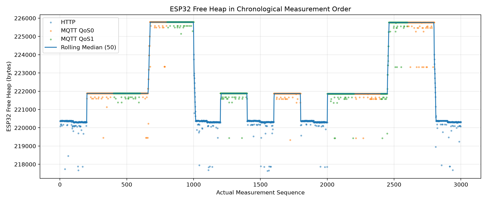

---

## Raspberry Pi Resource Usage

Raspberry Pi resource usage was measured with `psutil`.

```text
200 requests × 3 runs per protocol
Request interval: 0.2 s
Resource sampling interval: 0.2 s
```

### CPU

| Protocol | Python Worker CPU | Mosquitto CPU |
|---|---:|---:|
| HTTP | 0.429% | 0.008% |
| MQTT QoS 0 | 0.397% | 0.037% |
| MQTT QoS 1 | 0.403% | 0.043% |

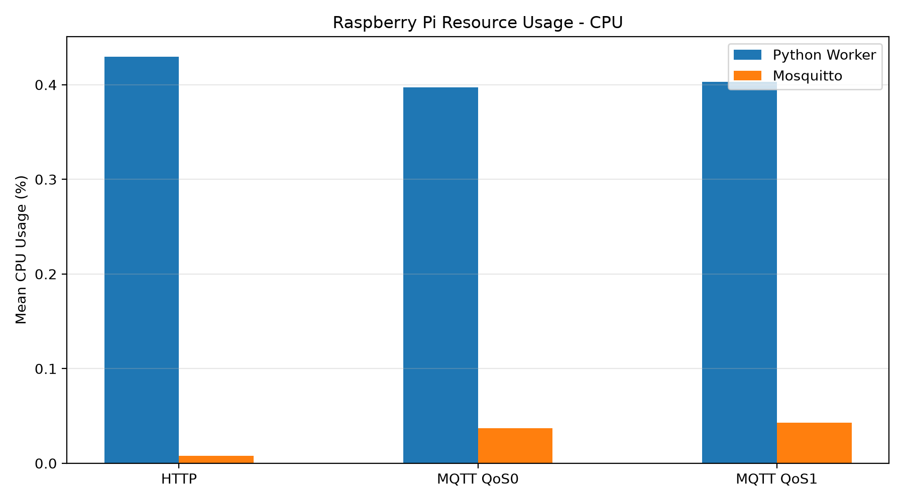

### Memory

| Protocol | Python Worker RSS | Mosquitto RSS |
|---|---:|---:|
| HTTP | 23.165 MiB | 8.406 MiB |
| MQTT QoS 0 | 23.371 MiB | 8.406 MiB |
| MQTT QoS 1 | 23.389 MiB | 8.406 MiB |

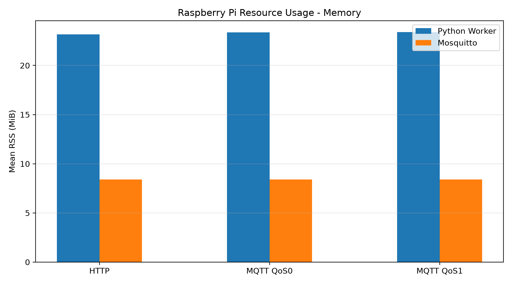

Under the tested sequential workload, all three protocol conditions produced low Raspberry Pi resource usage.

Mosquitto CPU activity increased during MQTT workloads compared with the HTTP idle condition, but the absolute usage remained small.

The CPU percentages are workload averages including the 0.2 s request interval and should not be interpreted as per-request CPU costs.

---

## Light Control End-to-End Latency

Physical Light Switch latency was measured separately from the protocol benchmark.

```text
ON   : 10 measurements
OFF  : 10 measurements
Total: 20 measurements
```

| Metric | Value |
|---|---:|
| ON Mean | 1032.498 ms |
| OFF Mean | 1031.995 ms |
| Overall Mean | **1032.247 ms** |
| Overall Median | 1031.450 ms |
| Min | 1028.087 ms |
| Max | 1040.075 ms |

The programmed actuator sequence includes:

```text
Press Hold  : 400 ms
Return Wait : 600 ms

Total Programmed Delay
= 1000 ms
```

Mean E2E breakdown:

```text
Measured E2E
= 1032.247 ms

Programmed Actuator Delay
= 1000 ms
≈ 96.9%

Non-programmed Remainder
≈ 32.247 ms
≈ 3.1%
```

The physical Light Control path was therefore dominated by the intentionally programmed actuator timing rather than the communication RTT.

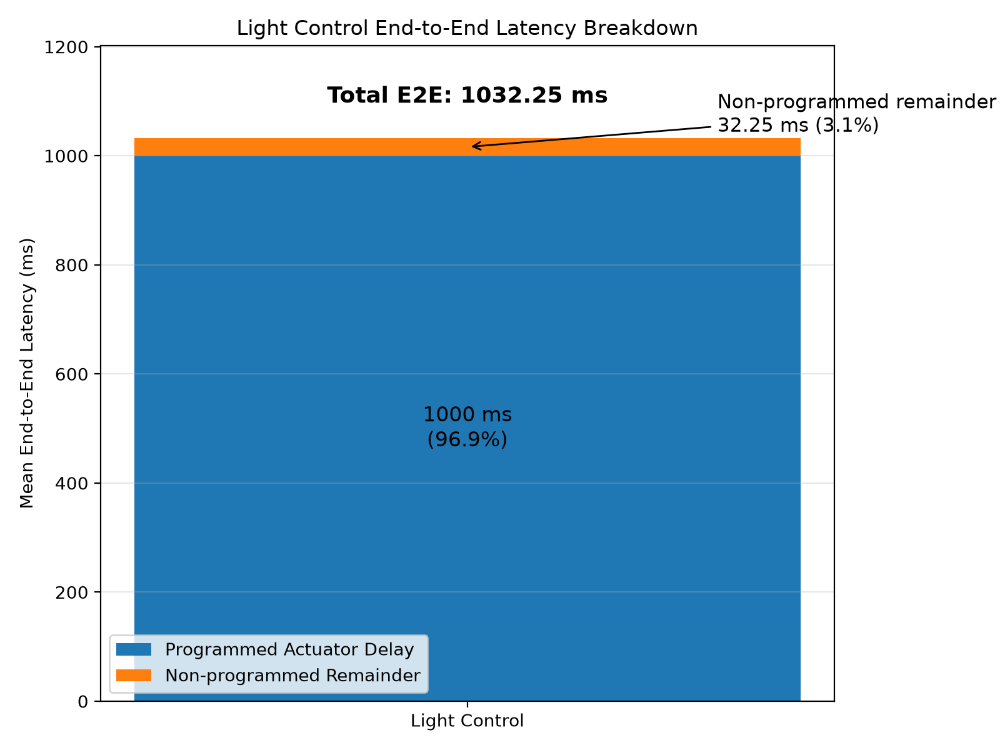

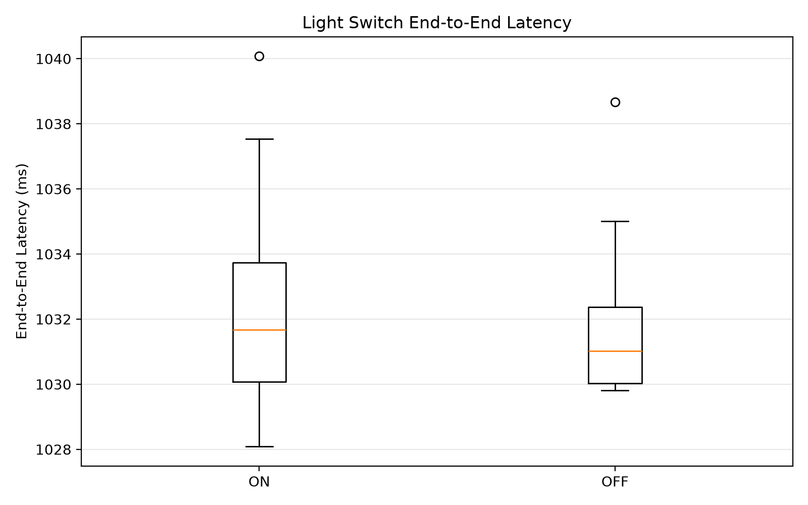

---

## Actuation Reliability Improvement

The initial MG90S-based prototype achieved:

```text
7 / 20 successful actuations
= 35%
```

The final configuration combined:

- MG996R servo
- Stronger mechanical mounting
- 5° / 10° control-angle calibration

Final test:

```text
ON  : 20 / 20
OFF : 20 / 20

Total
40 / 40
= 100%
```

The reliability improvement is attributed to the combined effect of actuator capability, mechanical mounting, and angle calibration rather than servo torque alone.

### Short-Term Servo Stress Test

```text
Duration       : 10 min
Cycles         : 172
Surface Temp   : approximately 26.5°C → 27.8°C
Reset / Failure: none observed
```

---

## Main Findings

1. **MQTT QoS 0 produced the lowest application-level RTT in the tested environment.**
2. **Measured ESP32 handler processing was not the main source of protocol-dependent RTT differences.**
3. **ESP32 Wi-Fi power-saving configuration had a large effect on latency.**
4. **Raspberry Pi 5 resource usage remained low under the tested workload.**
5. **Physical actuation timing dominated user-visible Light Control latency.**
6. **Reliable physical control depended on actuator selection, mounting, and calibration as well as software.**

---

## Repository Structure

```text
.
├── analysis/
│   ├── analyze_protocol_benchmark.py
│   ├── plot_protocol_benchmark.py
│   ├── plot_bottleneck_heap.py
│   ├── plot_pi_resources.py
│   └── plot_light_e2e.py
│
├── data/
│   ├── README.md
│   ├── README_EN.md
│   ├── raw/
│   │   ├── main/
│   │   ├── diagnostic/
│   │   ├── excluded/
│   │   └── legacy/
│   ├── processed/
│   └── figures/
│
├── esp32/
├── raspberry-pi/
├── docs/
├── images/
├── report/
├── README.md
└── README_EN.md
```

Detailed dataset documentation:

[한국어](data/README.md) | [English](data/README_EN.md)

---

## Analysis Environment

```text
Python      3.13.5
pandas      3.0.5
NumPy       2.5.2
Matplotlib  3.11.1
psutil      7.2.2
paho-mqtt   2.1.0
```

MQTT:

```text
Mosquitto Broker   2.0.21
ESP32 MQTT Library MQTT by Joel Gaehwiler 2.5.3
```

ESP32 development:

```text
Arduino IDE 2.3.10
Board: ESP32 Dev Module
Serial Baud: 115200
```

---

## Reproducing the Analysis

```bash
python analysis/analyze_protocol_benchmark.py
python analysis/plot_protocol_benchmark.py
python analysis/plot_bottleneck_heap.py
python analysis/plot_pi_resources.py
python analysis/plot_light_e2e.py
```

Raw CSV files are treated as the source of truth.

---

## Data Policy

```text
main
→ final datasets used for analysis

diagnostic
→ dry runs and diagnostic experiments

excluded
→ measurements excluded because the experimental
   condition was invalid or could not be verified

legacy
→ historical development-stage measurements
```

Rejected or invalid measurements are preserved with their exclusion reason instead of being silently deleted.

---

## Limitations

- Measurements were performed in one local Wi-Fi environment.
- Artificial packet loss and network congestion were not introduced.
- All final protocol requests succeeded, so QoS reliability differences under packet loss were not experimentally demonstrated.
- Raspberry Pi and ESP32 do not share a synchronized clock, so absolute timestamps from different devices are not directly subtracted.
- `RTT - ESP Processing` is not treated as pure network latency.
- Light E2E is based on application request completion, not an external sensor timestamp of physical switch contact.
- Heap conclusions are limited to the measured workload.
- The Raspberry Pi resource experiment used a sequential 0.2 s request workload and is not a maximum-throughput test.

---

## Future Interests

Through this project, I became more interested not only in implementing working features, but also in measuring latency and resource usage in real systems and analyzing the causes of performance differences.

Going forward, I would like to study operating systems, memory systems, and computer architecture in more depth, and further develop my experience in system performance analysis.

---

## Project Direction

The goal of this project is not only to move a servo remotely.

It is to build a working edge IoT system and then identify **where latency and reliability problems actually occur across the system stack**.

```text
Communication Layer
→ Protocol / Wi-Fi Configuration

Embedded Runtime
→ ESP32 Processing / Heap

Edge Host
→ Raspberry Pi / Mosquitto Resource

Physical Layer
→ Actuator Delay / Mounting / Calibration
```

The main value of this project is the process of moving from functional implementation to measurement, diagnosis, and bottleneck analysis.
